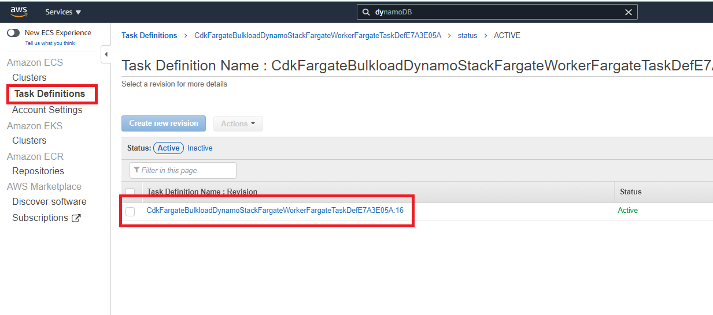
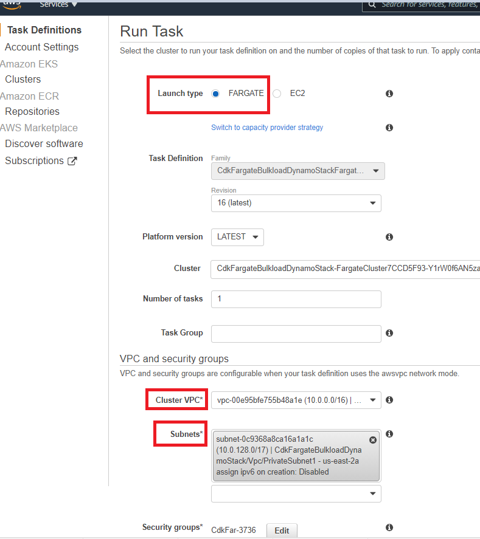

# Bulk load CSV file to Amazon DynamoDb using CDK Fargate Task

## Problem

Sometimes we need a way to load a huge CSV file to DynamoDb, for
downstream consumption. We can use one off Fargate Task to load the
files.

## Solution

In this example, I will show you how the create CDK Fargate (Typescript)
container image, which can be used to run a one-off task to load a large
CSV file into the DynamoDb table. DynamoDb fields and their data types
can be chosen dynamically before running the task, using environment
file.

1)  Once CDK solution has been deployed, go to your AWS console, and
    navigate to ECS. Look for your task and

{width="6.5in"
height="2.8784722222222223in"}

2)  Select the check box next the task, and click Actions, then click
    "Run Task".

3)  Once on "Run Task" page, select launch type as "Fargate", then
    select the VPC and Subnet created by CDK, as shown in picture below.

{width="6.5in"
height="7.307638888888889in"}

4)  Then click "Run Task" at bottom of the page.

5)  ECS service will launch the Fargate container, and start downloading
    bulk csv file as a stream from S3.

6)  Same csv data stream is than passed to DynamoDb Batch Write, in
    batches to insert data in to DynamoDb table.

7)  You can look at progress of the task on cloud watch logs console.
